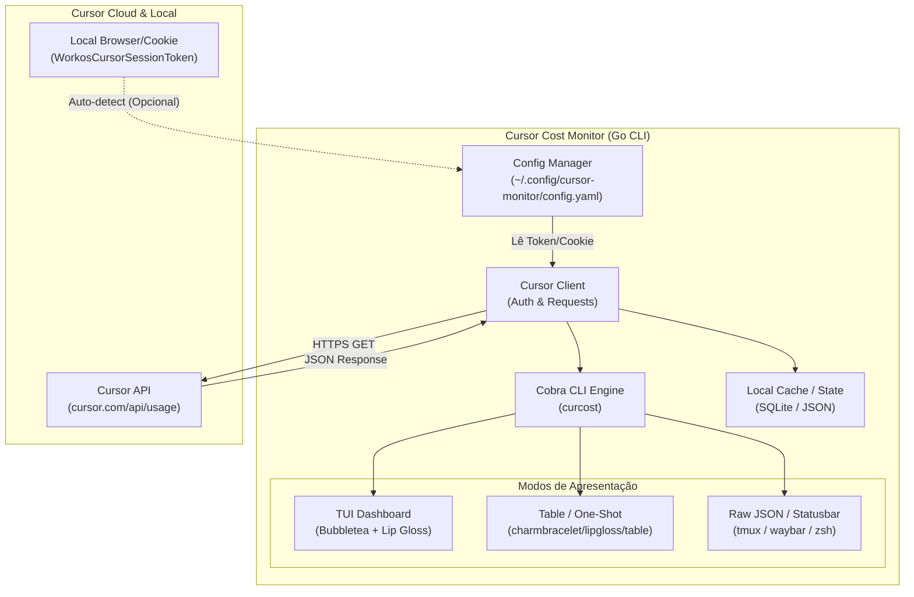

# Planner de Desenvolvimento: Cursor Cost & Usage Monitor (Go CLI/TUI)

Plano de arquitetura, fases de entrega e roadmap para a criação de um monitor de consumo e custos da conta do **Cursor** via terminal, desenvolvido em **Golang**.

---

## 1. Visão Geral e Objetivos

O objetivo é criar uma ferramenta de linha de comando leve, rápida e multiplataforma em Go que permita acompanhar em tempo real:
- **Consumo do ciclo atual**: requisições rápidas (*fast requests*) utilizadas e restantes (ex: 500/500).
- **Custos adicionais (*usage-based pricing*)**: total gasto em dólares além da cota do plano Pro/Business.
- **Limites configurados**: hard limit e soft limit definidos no dashboard.
- **Detalhamento por modelo**: chamadas divididas por Claude 3.5 Sonnet, GPT-4o, etc. (conforme disponibilidade pela API).
- **Modos de exibição**:
  - `one-shot`: saída direta em tabela ou JSON (ideal para scripts, prompts de terminal/tmux status).
  - `watch` / `tui`: interface reativa e estilizada no terminal (TUI) com atualização contínua.

---

## 2. Arquitetura Proposta



### Stack Tecnológica Sugerida

| Componente | Biblioteca Go | Justificativa |
| :--- | :--- | :--- |
| **CLI Framework** | `github.com/spf13/cobra` | Padrão da comunidade, suporte a subcomandos, flags e autocomplete. |
| **Configuração** | `github.com/spf13/viper` | Suporte a arquivos YAML/JSON, variáveis de ambiente e valores padrão. |
| **TUI Reativa** | `github.com/charmbracelet/bubbletea` | Framework Elm-like para interfaces ricas, limpas e responsivas em terminal. |
| **Estilização/Cores** | `github.com/charmbracelet/lipgloss` | Definição de layouts, bordas, cores e alinhamento em terminal. |
| **HTTP Client** | `net/http` padrão com timeouts | Zero dependências pesadas, seguro e performático. |

---

## 3. Fontes de Dados e Mecanismo de Autenticação

Como o Cursor não possui uma chave pública clássica de API exclusivamente para faturamento no dashboard, a coleta é feita via **Session Token** da conta:

1. **Token de Sessão (*WorkosCursorSessionToken*)**:
   - Cookie gerado ao efetuar login em `https://www.cursor.com/settings`.
   - Pode ser fornecido via flag `--token`, variável de ambiente `CURSOR_SESSION_TOKEN`, ou arquivo de configuração `~/.config/cursor-monitor/config.yaml`.
   - *Opcional futuro*: Extração automática lendo o cookie local do navegador ou do armazenamento local do VS Code/Cursor (`state.vscdb`).

2. **Endpoints principais mapeados**:
   - `GET https://www.cursor.com/api/usage` com cookie de sessão.
   - Retorna contagem de requisições rápidas, requisições lentas, limites e custo excedente acumulado.

---

## 4. Fases de Execução do Projeto

### Fase 1: PoC & Engenharia Reversa da API
- [ ] Validar a chamada HTTP manual ao endpoint de uso do Cursor com `curl`/Postman.
- [ ] Mapear o payload JSON retornado (campos de billing, datas de ciclo, limites de uso).
- [ ] Definir as `structs` em Go para serialização e desserialização (`UsageResponse`, `BillingCycle`, `ModelUsage`).

### Fase 2: Scaffolding e Core da CLI
- [ ] Inicializar o módulo Go (`go mod init github.com/username/cursor-cost-monitor`).
- [ ] Estruturar o projeto com convenção Go:
  ```text
  cmd/
    curcost/
      main.go
  internal/
    api/         # Cliente HTTP do Cursor
    config/      # Leitura de config e variáveis de ambiente
    model/       # Structs de dados
    tui/         # Telas e componentes Bubbletea
    output/      # Formatadores (JSON, Tabela Lip Gloss)
  ```
- [ ] Implementar leitura de configuração com `viper` (suporte a flag, env var e arquivo).

### Fase 3: Camada de API & Autenticação
- [ ] Implementar cliente HTTP resiliente com retry backoff exponencial e timeout de 10s.
- [ ] Tratamento explícito de erros HTTP 401 (sessão expirada), 429 (rate limit) e erros de rede.
- [ ] Implementar comando `curcost auth login` ou `curcost config set-token` para persistir o token com segurança (`0600` de permissão no arquivo).

### Fase 4: Modo Terminal Simples (One-shot)
- [ ] Comando padrão `curcost` ou `curcost status`:
  - Exibe tabela formatada com:
    - Barra de progresso visual de requisições rápidas (`[████████░░░░] 350/500`).
    - Gasto atual em USD vs. Limite de gastos configurado.
    - Dias restantes para renovação do ciclo.
- [ ] Flag `--json` para integração com scripts externos e prompt de terminal.
- [ ] Flag `--short` (ex: `⚡ 350/500 | 💰 $4.20`) para barras de status como tmux, Waybar ou Polybar.

### Fase 5: TUI Interativa & Watch Mode
- [ ] Implementar comando `curcost watch` ou `curcost dashboard` usando `bubbletea`.
- [ ] Componentes do dashboard:
  - Header com informações da conta e período do ciclo.
  - Gauge / Barra de progresso para cota rápida.
  - Card de custos com destaque visual (verde se < 50%, amarelo se > 75%, vermelho se próximo do limite).
  - Ticker de atualização configurável (ex: a cada 30s ou 1min).
  - Teclas de atalho: `r` (forçar refresh), `q` (sair), `c` (alternar ciclo).

### Fase 6: Notificações e Limites de Alerta
- [ ] Permitir configurar alertas no `config.yaml` (ex: `alert_spend_threshold: 20.00`).
- [ ] Notificação de sistema no desktop (via `notify-send` no Linux ou similar) quando o consumo ultrapassar uma porcentagem definida.

---

## 5. Riscos e Mitigações

| Risco | Impacto | Mitigação |
| :--- | :--- | :--- |
| **Expiração da Sessão** | O token de cookie pode expirar periodicamente. | Detectar erro 401 e exibir mensagem amigável instruindo a renovação do token. |
| **Mudança de Endpoint Privado** | Como não é API pública versionada, o Cursor pode alterar schemas. | Isolar a camada de client HTTP e modelagem; criar testes de contrato/fixtures. |
| **Rate Limiting** | Bloqueio temporário por requisições excessivas no modo watch. | Intervalo mínimo de polling de 30 segundos com suporte a cache local temporário. |
